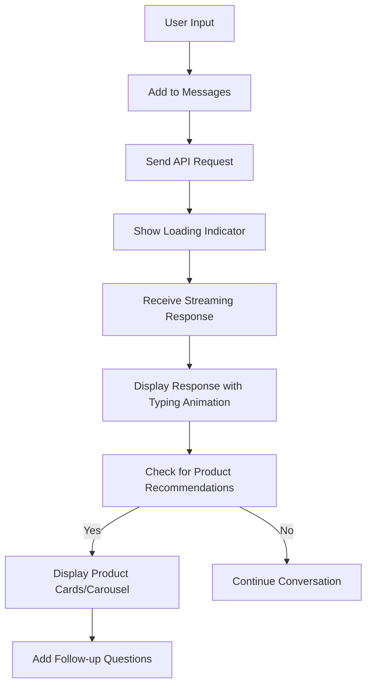

# 💬 Chat Interface Documentation

This document provides a comprehensive overview of how the chat interface is implemented, including its visual design, functionality, and integration with backend systems.

## 🧱 1. Component Overview

The chat interface is a sophisticated component that combines multiple technologies to provide an engaging conversation experience. It is implemented using:

- **Main Component**: `components/ChatInterface.tsx`
- **Styling**: `styles/ChatInterface.module.css`
- **State Management**: React hooks (useState, useEffect)
- **API Integration**: `app/api/chat/route.ts`

### ✨ Key Features

- Responsive design that adapts to different screen sizes
- Message history persistence
- Typing animation for AI responses
- Product recommendation display (single card or carousel)
- Follow-up question suggestions
- New conversation functionality
- Autoscroll control

## 🛠️ 2. Implementation Details

### 📁 File Structure
```
├── components/
│   └── ChatInterface.tsx - Main chat UI component
│   ├── ChatMessage.tsx - Individual message rendering
│   └── ProductCard.tsx - Product recommendation display
├── styles/
│   └── ChatInterface.module.css - Component-specific styling
└── app/
    └── api/
        └── chat/
            └── route.ts - Main chat API logic
```

### 🧩 Core Dependencies

- **React**: For component-based UI development
- **Next.js**: For server-side rendering and API routes
- **Tailwind CSS**: For utility-first styling
- **Embla Carousel**: For product recommendation carousel
- **Pino**: For logging and debugging
- **Upstash Redis**: For caching and session management

## 🖼️ 3. Visual Design

### 🎨 Overall Layout

The chat interface follows a clean, modern design with these key elements:

1. **Header**: Contains the chatbot title/logo
2. **Message Area**: Displays the conversation history
3. **Input Area**: Where users type their messages
4. **Suggested Questions**: Optional follow-up questions

### 📸 Example View


### 🧱 Message Display

Each message in the chat has a distinct appearance based on its origin:

- **User Messages**: Aligned to the right with a distinct background color
- **AI Messages**: Aligned to the left with a different background color
- **System Messages**: Centered with subtle formatting

```css
/* ChatInterface.module.css - Message styling */
.message-bubble {
  padding: 1rem;
  border-radius: 0.5rem;
  margin-bottom: 1rem;
}

.user-message {
  background-color: #bfdbfe;
  align-self: flex-end;
}

.ai-message {
  background-color: #f1f5f9;
  align-self: flex-start;
}
```

## ⚙️ 4. Functional Components

### 🧠 State Management

The chat interface uses React hooks for state management:

```tsx
// ChatInterface.tsx - State declarations
const [messages, setMessages] = useState<ChatMessage[]>([]);
const [input, setInput] = useState('');
const [isLoading, setIsLoading] = useState(false);
const [showNewConversation, setShowNewConversation] = useState(false);
```

### 🔄 Message Flow

1. User types a message in the input field
2. Message is added to the messages array
3. Request is sent to the chat API endpoint
4. Streaming response is received and displayed with typing animation
5. Response may include product recommendations and follow-up questions
6. Conversation history is maintained for context-aware responses



## 🧩 5. Complete Chat Interface Flow

To help understand how the chat interface interacts with all components, here's a complete implementation flow:

```
sequenceDiagram
    participant User
    participant Frontend
    participant API
    participant LLM
    participant Redis
    participant VectorDB
    participant Shopify

    User->>Frontend: Opens chat interface
    Frontend->>Redis: Loads user's chat history
    Redis-->>Frontend: Returns stored messages
    Frontend->>User: Displays chat history and welcome message
    User->>Frontend: Types query or clicks example
    Frontend->>API: Sends query with userId and conversation history
    API->>Redis: Checks for cached response
    Redis-->>API: No cache hit
    API->>LLM: Sends query for analysis
    LLM-->>API: Returns structured response with intent and keywords
    API->>VectorDB: Performs vector search if product query
    VectorDB-->>API: Returns product matches
    API->>Shopify: Enriches results with detailed product info
    Shopify-->>API: Returns product details
    API->>Redis: Caches response and updates knowledge base
    API-->>Frontend: Returns formatted response with advice and products
    Frontend->>User: Displays response with appropriate formatting
    Frontend->>Redis: Stores new interaction in Redis
```

## 🧪 6. Testing Considerations (Expanded)

- Test chat interface rendering on different device sizes
- Verify message ordering is preserved correctly
- Ensure proper handling of long conversations
- Test loading of older messages works as expected
- Validate that new conversation functionality clears state properly
- Check contextual suggestions generation remains relevant
- Test message rendering handles long content correctly
- Verify accessibility features work correctly
- Ensure keyboard navigation is intuitive
- Test screen reader compatibility
- Validate proper error handling for API failures
- Check that scroll behavior enhances user experience
- Test with empty or invalid product data
- Ensure smooth transitions between states
- Verify message timestamps are displayed correctly
- Test with extreme message lengths and content

## 📚 7. Further Reading

- [Next.js App Router Documentation](https://nextjs.org/docs/app)
- [React TypeScript Best Practices](https://react-typescript-cheatsheet.netlify.app/)
- [Tailwind CSS Documentation](https://tailwindcss.com/docs)
- [Upstash Redis Documentation](https://docs.upstash.com/redis)
- [Upstash Vector Documentation](https://docs.upstash.com/vector)