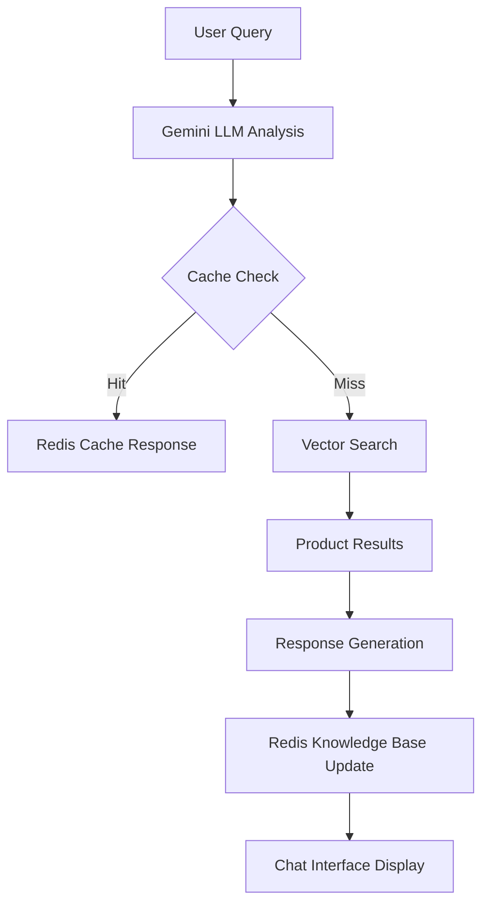

# 🧠 LLM & Redis Integration Documentation

This document provides a comprehensive overview of how the Gemini LLM (`llm.ts`) and Redis (`redis.ts`) components work together in the Planet Beauty AI Chatbot system.

## 🔗 1. System Overview

The integration between Gemini LLM and Redis creates a powerful combination for intelligent, context-aware responses with efficient caching and knowledge management.



## 🛠️ 2. Implementation Details

### 📁 File Structure

```
├── lib/
│   ├── llm.ts - Gemini LLM integration
│   └── redis.ts - Redis cache and knowledge base
├── app/
│   └── api/
│       └── chat/
│           └── route.ts - Main chat API logic
└── types/
    └── index.ts - Type definitions
```

### 🧩 Key Technologies

- **Google Gemini API**: For natural language understanding and response generation
- **Upstash Redis**: For caching responses and maintaining knowledge base
- **Next.js App Router**: For server-side rendering and API routes
- **Pino**: For logging and debugging

## 💡 3. LLM (Gemini) Integration

### 🧠 Core Functionality

The LLM integration in `llm.ts` handles:

- Natural language understanding of user queries
- Generation of structured responses
- Product recommendation reasoning
- Follow-up question generation
- Context-aware conversation flow

``typescript
// lib/llm.ts - Gemini model configuration
import { GoogleGenerativeAI, HarmBlockThreshold, HarmCategory } from '@google/generative-ai';

const logger = pino({ level: 'warn' });

// Validate environment variables
if (!process.env.GEMINI_API_KEY) {
  throw new Error('GEMINI_API_KEY must be set for Gemini provider');
}

// Initialize Gemini
const genAI = new GoogleGenerativeAI(process.env.GEMINI_API_KEY);
const model = genAI.getGenerativeModel({
  model: 'gemini-1.5-flash',
  safetySettings: [
    { category: HarmCategory.HARM_CATEGORY_HARASSMENT, threshold: HarmBlockThreshold.BLOCK_MEDIUM_AND_ABOVE },
    { category: HarmCategory.HARM_CATEGORY_HATE_SPEECH, threshold: HarmBlockThreshold.BLOCK_MEDIUM_AND_ABOVE },
    { category: HarmCategory.HARM_CATEGORY_SEXUALLY_EXPLICIT, threshold: HarmBlockThreshold.BLOCK_MEDIUM_AND_ABOVE },
    { category: HarmCategory.HARM_CATEGORY_DANGEROUS_CONTENT, threshold: HarmBlockThreshold.BLOCK_MEDIUM_AND_ABOVE },
  ],
});
```

### 🪄 Prompt Engineering

The system uses sophisticated prompt engineering to produce consistent, structured responses:

``typescript
// lib/llm.ts - Example prompt structure
export async function generateLLMResponse(
  systemPrompt: string,
  chatHistory: ChatHistory,
  userQuery: string
): Promise<LLMStructuredResponse> {
  if (!userQuery.trim()) {
    // Handle empty queries
    return {
      is_product_query: false,
      search_keywords: [],
      product_types: [],
      attributes: [],
      vendor: null,
      price_filter: null,
      requested_product_count: 0,
      ai_understanding: 'empty query',
      advice: 'Please provide a query to get started!',
      sort_by_price: false,
      usage_instructions: '',
      is_combo_set_query: false,
      is_fictional_product_query: false,
      is_clarification_needed: true,
      is_ingredient_query: false,
      skin_concern: [],
      is_price_range_query: false,
      response_confidence: 0.1,
      suggested_follow_ups: ['What beauty products are you looking for?'],
      is_out_of_stock_query: false,
      query_language: 'en',
      is_comparison_query: false,
      cache_ttl_override: 3600,
      is_location_specific: false,
      user_intent_priority: 'general_info',
      alternative_product_types: [],
      is_feedback_request: false,
      contextual_clarification: 'Empty query received.',
      is_subscription_query: false,
      is_personalized_query: false,
      product_application_time: [],
      is_promotion_query: false,
      user_sentiment: 'neutral',
      is_gift_query: [],
      product_packaging: [],
      is_educational_query: false,
      related_categories: [],
      is_urgency_indicated: false,
      query_complexity: 0,
    };
  }

  // Preprocess query to determine intent and structure
  const metadata = preprocessQuery(userQuery, chatHistory);
  
  // Check knowledge base for cached answers
  const kbEntry = await getKnowledgebaseEntry(userQuery);

  if (kbEntry && kbEntry.confidence > 0.7) {
    logger.info({ query: userQuery }, 'Using cached knowledgebase entry');
    const response = {
      ...metadata.fields,
      advice: kbEntry.answer,
      response_confidence: kbEntry.confidence,
      query_complexity: metadata.complexity,
    };
    return response;
  }

  // Generate keywords using LLM
  let keywords: string[] = [];
  try {
    const prompt = `Extract 3-5 keywords from this query for vector search: "${userQuery}". Return as JSON: ["keyword1", "keyword2"]`;
    const result = await model.generateContent(prompt);
    const llmResponse = result.response.text();
    logger.info({ llmResponse }, 'Raw response from LLM for keyword generation');
    try {
      keywords = JSON.parse(llmResponse);
    } catch (e) {
      logger.error({ e, llmResponse }, 'Invalid LLM response format for keywords');
    }
  } catch (e) {
    logger.error({ e, userQuery }, 'Failed to generate keywords using LLM');
  }

  // Fallback logic for keyword extraction
  if (!keywords.length) {
    keywords = userQuery.toLowerCase().split(' ').filter(word => word.length > 3);
    logger.warn({ keywords, userQuery }, 'Using fallback keyword extraction');
  }

  // Get conversational advice
  const advice = await getConversationalAdvice(userQuery, metadata, 'gemini');

  // Construct final response
  const response: LLMStructuredResponse = {
    is_product_query: metadata.fields.is_product_query,
    search_keywords: keywords,
    product_types: metadata.fields.product_types,
    attributes: metadata.fields.attributes,
    vendor: metadata.fields.vendor,
    price_filter: metadata.fields.price_filter,
    requested_product_count: metadata.fields.requested_product_count,
    ai_understanding: metadata.fields.ai_understanding,
    advice: advice,
    sort_by_price: metadata.fields.sort_by_price,
    usage_instructions: metadata.fields.usage_instructions,
    is_combo_set_query: metadata.fields.is_combo_set_query,
    is_fictional_product_query: metadata.fields.is_fictional_product_query,
    is_clarification_needed: metadata.fields.is_clarification_needed,
    is_ingredient_query: metadata.fields.is_ingredient_query,
    skin_concern: metadata.fields.skin_concern,
    is_price_range_query: metadata.fields.is_price_range_query,
    response_confidence: metadata.fields.response_confidence,
    suggested_follow_ups: metadata.fields.suggested_follow_ups,
    is_out_of_stock_query: metadata.fields.is_out_of_stock_query,
    query_language: metadata.fields.query_language,
    is_comparison_query: metadata.fields.is_comparison_query,
    cache_ttl_override: metadata.fields.cache_ttl_override,
    is_location_specific: metadata.fields.is_location_specific,
    user_intent_priority: metadata.fields.user_intent_priority,
    alternative_product_types: metadata.fields.alternative_product_types,
    is_feedback_request: metadata.fields.is_feedback_request,
    contextual_clarification: metadata.fields.contextual_clarification,
    is_subscription_query: metadata.fields.is_subscription_query,
    is_personalized_query: metadata.fields.is_personalized_query,
    product_application_time: metadata.fields.product_application_time,
    is_promotion_query: metadata.fields.is_promotion_query,
    user_sentiment: metadata.fields.user_sentiment,
    is_gift_query: metadata.fields.is_gift_query,
    product_packaging: metadata.fields.product_packaging,
    is_educational_query: metadata.fields.is_educational_query,
    related_categories: metadata.fields.related_categories,
    is_urgency_indicated: metadata.fields.is_urgency_indicated,
    query_complexity: metadata.fields.query_complexity,
  };
  return response;
}
```

### 🔍 Query Preprocessing

The LLM includes sophisticated preprocessing to categorize and understand user queries:

``typescript
// lib/llm.ts - Query preprocessing
function preprocessQuery(query: string, chatHistory: ChatHistory): QueryMetadata {
  const normalizedQuery = query.trim().toLowerCase();
  const isProductQuery = /(lipstick|moisturizer|serum|sunscreen|mascara|cleanser|toner|shampoo|conditioner|lotion|mask|treatment|oil|balm|cream|gel|powder|spray|set|combo)/i.test(normalizedQuery);
  const complexity = normalizedQuery.split(' ').length > 5 || /and|for|under|between/i.test(normalizedQuery) ? 5 : 3;
  const isFictional = isPotentiallyFictional(normalizedQuery);
  const isClarification = isFollowUpClarification(normalizedQuery, chatHistory);

  let intent = isProductQuery ? 'product_search' : 'general_info';
  if (isFictional) intent = 'nonsense';
  if (isClarification) intent = 'clarification';

  const fields: Partial<LLMStructuredResponse> = {
    is_product_query: isProductQuery && !isFictional && !isClarification,
    search_keywords: [],
    product_types: [],
    attributes: [],
    vendor: null,
    price_filter: extractPriceFilter(normalizedQuery),
    requested_product_count: isProductQuery ? (normalizedQuery.includes('set') ? 3 : normalizedQuery.includes('combo') || normalizedQuery.includes('and') ? 2 : 1) : 0,
    ai_understanding: isProductQuery
      ? 'product query'
      : isFictional
        ? 'query for fictional product'
        : isClarification
          ? 'follow-up clarification'
          : 'general question',
    sort_by_price: /cheap|cheapest/i.test(normalizedQuery),
    usage_instructions: isProductQuery ? 'Apply to clean skin.' : '',
    is_combo_set_query: /set|combo/i.test(normalizedQuery),
    is_fictional_product_query: isFictional,
    is_clarification_needed: isClarification,
    is_ingredient_query: /retinol|paraben|vegan/i.test(normalizedQuery),
    skin_concern: normalizedQuery.match(/dry skin|oily skin|sensitive skin|redness|acne/i)?.[0]?.split(' ') || [],
    is_price_range_query: /between\s*\$?\d+\s*and\s*\$?\d+/i.test(normalizedQuery),
    response_confidence: isProductQuery ? 0.9 : isFictional ? 0.3 : isClarification ? 0.7 : 0.5,
    suggested_follow_ups: isProductQuery ? ['Any specific brands?', 'Want vegan options?'] : [],
    is_out_of_stock_query: /in stock|available/i.test(normalizedQuery),
    query_language: 'en',
    is_comparison_query: /vs|compare/i.test(normalizedQuery),
    cache_ttl_override: isProductQuery ? 3600 : 0,
    is_location_specific: /tropical|nyc/i.test(normalizedQuery),
    user_intent_priority: intent,
    alternative_product_types: isFictional ? ['moisturizer', 'serum'] : [],
    is_feedback_request: /review|feedback/i.test(normalizedQuery),
    contextual_clarification: isClarification ? 'Please specify the product or brand.' : '',
    is_subscription_query: /subscription|monthly/i.test(normalizedQuery),
    is_personalized_query: false,
    product_application_time: isProductQuery ? ['anytime'] : [],
    is_promotion_query: /sale|discount/i.test(normalizedQuery),
    user_sentiment: /now|urgent/i.test(normalizedQuery) ? 'urgent' : 'neutral',
    is_gift_query: /gift/i.test(normalizedQuery) ? ['gift'] : [],
    product_packaging: /travel-size|eco-friendly/i.test(normalizedQuery) ? ['travel-size'] : [],
    is_educational_query: /how to|what is/i.test(normalizedQuery),
    related_categories: isProductQuery ? ['cleanser', 'toner'] : [],
    is_urgency_indicated: /now|urgent/i.test(normalizedQuery),
    query_complexity: complexity,
  };

  if (isProductQuery && !isFictional && !isClarification) {
    // Extract product types, brands, and attributes
    const productTypeMatch = normalizedQuery.match(/lipstick|moisturizer|serum|sunscreen|mascara|cleanser|toner/i);
    fields.product_types = productTypeMatch?.map(p => p.toLowerCase()) || [];
    fields.search_keywords = productTypeMatch?.map(p => p.toLowerCase()) || [];

    const brandMatch = normalizedQuery.match(/guinot|clinique|planet beauty/i);
    if (brandMatch) {
      fields.vendor = brandMatch[0].toLowerCase();
      fields.search_keywords.push(brandMatch[0].toLowerCase());
    }

    fields.attributes = normalizedQuery.match(/vegan|cruelty-free|paraben-free/i)?.map(a => a.toLowerCase()) || [];
    
    fields.search_keywords = [...fields.search_keywords, ...normalizedQuery.match(/vegan|cruelty-free|cheap/i)?.map(k => k.toLowerCase()) || []];

    fields.requested_product_count = impliesProductList(normalizedQuery) ? 10 : fields.requested_product_count || 1;

    fields.usage_instructions = fields.product_types?.includes('serum')
      ? 'Apply to clean skin before moisturizer.'
      : fields.product_types?.includes('sunscreen')
        ? 'Apply generously 15 minutes before sun exposure.'
        : 'Apply to clean skin.';

    fields.product_application_time = fields.product_types?.includes('eye cream') ? ['night'] : ['morning', 'night'];
  }

  // Ensure all fields are defined with defaults
  const completeFields: LLMStructuredResponse = {
    is_product_query: fields.is_product_query ?? false,
    search_keywords: fields.search_keywords ?? [],
    product_types: fields.product_types ?? [],
    attributes: fields.attributes ?? [],
    vendor: fields.vendor ?? null,
    price_filter: fields.price_filter ?? null,
    requested_product_count: fields.requested_product_count ?? 0,
    ai_understanding: fields.ai_understanding ?? 'general question',
    advice: fields.advice ?? 'Let’s find what you need!',
    sort_by_price: fields.sort_by_price ?? false,
    usage_instructions: fields.usage_instructions ?? '',
    is_combo_set_query: fields.is_combo_set_query ?? false,
    is_fictional_product_query: fields.is_fictional_product_query ?? false,
    is_clarification_needed: fields.is_clarification_needed ?? false,
    is_ingredient_query: fields.is_ingredient_query ?? false,
    skin_concern: fields.skin_concern ?? [],
    is_price_range_query: fields.is_price_range_query ?? false,
    response_confidence: fields.response_confidence ?? 0.5,
    suggested_follow_ups: fields.suggested_follow_ups ?? [],
    is_out_of_stock_query: fields.is_out_of_stock_query ?? false,
    query_language: fields.query_language ?? 'en',
    is_comparison_query: fields.is_comparison_query ?? false,
    cache_ttl_override: fields.cache_ttl_override ?? 3600,
    is_location_specific: fields.is_location_specific ?? false,
    user_intent_priority: fields.user_intent_priority ?? 'general_info',
    alternative_product_types: fields.alternative_product_types ?? [],
    is_feedback_request: fields.is_feedback_request ?? false,
    contextual_clarification: fields.contextual_clarification ?? '',
    is_subscription_query: fields.is_subscription_query ?? false,
    is_personalized_query: fields.is_personalized_query ?? false,
    product_application_time: fields.product_application_time ?? [],
    is_promotion_query: fields.is_promotion_query ?? false,
    user_sentiment: fields.user_sentiment ?? 'neutral',
    is_gift_query: fields.is_gift_query ?? [],
    product_packaging: fields.product_packaging ?? [],
    is_educational_query: fields.is_educational_query ?? false,
    related_categories: fields.related_categories ?? [],
    is_urgency_indicated: fields.is_urgency_indicated ?? false,
    query_complexity: fields.query_complexity ?? 0,
  };

  return { intent, fields: completeFields, complexity };
}
```

## 🗄️ 4. Redis Integration

### 🧠 Core Functionality

Redis serves multiple critical roles in the system:

- **Caching**: Storing frequent queries for faster response
- **Session Management**: Maintaining conversation history
- **Knowledge Base**: Storing information about non-product topics
- **Rate Limiting**: Preventing abuse of the API
- **Embedding Caching**: Storing generated embeddings for faster response

``typescript
// lib/redis.ts - Redis client initialization
import { Redis } from '@upstash/redis';
import pino from 'pino';
import {
  ChatApiResponse, ChatMessage
} from './types';

export const redisClient = new Redis({
  url: process.env.AICHATBOTZ_KV_REST_API_URL || '',
  token: process.env.AICHATBOTZ_KV_REST_API_TOKEN || '',
});

const logger = pino({ level: 'info' });

// Cache prefixes
const RESPONSE_CACHE_PREFIX = 'chat:response:';
const SESSION_PREFIX = 'chat:session:'; // Use this prefix for list keys
const KNOWLEDGEBASE_PREFIX = 'chat:knowledgebase:';
const EMBEDDING_PREFIX = 'chat:embedding:';

// TTLs (in seconds)
const RESPONSE_TTL = 600; // 10 minutes
const SESSION_TTL = 604800; // 7 days (Updated as per plan)
const KNOWLEDGEBASE_TTL = 2592000; // 30 days
const EMBEDDING_TTL = 86400; // 1 day
```

### 🔁 Caching Mechanism

The caching system ensures fast responses for common queries with proper error handling:

``typescript
// lib/redis.ts - Caching functions
export async function cacheResponse(userId: string, query: string, response: ChatApiResponse): Promise<void> {
  const normalizedQuery = normalizeQuery(query);
  const cacheKey = `${RESPONSE_CACHE_PREFIX}${userId}:${normalizedQuery}`;
  const keywords = extractKeywords(query);
  const cached: CachedResponse = {
    query: normalizedQuery,
    response,
    keywords,
    timestamp: Date.now(),
  };

  try {
    const ttl = response.cache_ttl_override || RESPONSE_TTL;
    await redisClient.setex(cacheKey, ttl, JSON.stringify(cached));
    logger.info({ cacheKey }, 'Cached response.');
  } catch (error) {
    logger.error({ error, cacheKey }, 'Failed to cache response.');
  }
}

export async function getCachedResponse(userId: string, query: string): Promise<CachedResponse | null> {
  const normalizedQuery = normalizeQuery(query);
  const cacheKey = `${RESPONSE_CACHE_PREFIX}${userId}:${normalizedQuery}`;

  try {
    const cached = await redisClient.get<string>(cacheKey);
    if (cached) {
      logger.info({ cacheKey }, 'Cache hit for response.');
      return JSON.parse(cached);
    }

    logger.debug({ cacheKey }, 'Cache miss for response.');
    return null;
  } catch (error) {
    logger.error({ error, cacheKey }, 'Error retrieving cached response.');
    return null;
  }
}
```

### 🔄 Embedding Caching

The system caches generated embeddings to improve performance:

``typescript
// lib/redis.ts - Embedding caching functions
export async function cacheEmbedding(userId: string, query: string, intent: string, fields: Partial<ChatApiResponse>): Promise<void> {
  const normalizedQuery = normalizeQuery(query);
  const cacheKey = `${EMBEDDING_PREFIX}${userId}:${normalizedQuery}`;
  const cached: CachedEmbedding = {
    query: normalizedQuery,
    intent,
    fields,
    timestamp: Date.now(),
  };

  try {
    await redisClient.setex(cacheKey, EMBEDDING_TTL, JSON.stringify(cached));
    logger.info({ cacheKey }, 'Cached embedding.');
  } catch (error) {
    logger.error({ error, cacheKey }, 'Failed to cache embedding.');
  }
}

export async function getCachedEmbedding(userId: string, query: string): Promise<CachedEmbedding | null> {
  const normalizedQuery = normalizeQuery(query);
  const cacheKey = `${EMBEDDING_PREFIX}${userId}:${normalizedQuery}`;
  try {
    const cached = await redisClient.get<string>(cacheKey);
    return cached ? JSON.parse(cached) : null;
  } catch (error) {
    logger.error({ error, cacheKey }, 'Error retrieving cached embedding.');
    return null;
  }
}
```

### 🧠 Knowledge Base

The knowledge base stores information about non-product topics:

``typescript
// lib/redis.ts - Knowledge base functions
export async function updateKnowledgeBase(
  query: string, 
  answer: string, 
  productTypes?: string[], 
  attributes?: string[]
): Promise<void> {
  const normalizedQuery = normalizeQuery(query);
  const entry: KnowledgebaseEntry = {
    query: normalizedQuery,
    answer,
    keywords: extractKeywords(query),
    productTypes,
    attributes,
    confidence: 0.5,
    timestamp: Date.now(),
  };
  const cacheKey = `${KNOWLEDGEBASE_PREFIX}${normalizedQuery}`;
  try {
    await redisClient.setex(cacheKey, KNOWLEDGEBASE_TTL, JSON.stringify(entry));
    logger.info({ cacheKey: normalizedQuery }, 'Updated knowledgebase.');
  } catch (error) {
    logger.error({ error }, 'Failed to update knowledgebase.');
  }
}

export async function getKnowledgebaseEntry(query: string): Promise<KnowledgebaseEntry | null> {
  const normalizedQuery = normalizeQuery(query);
  const cacheKey = `${KNOWLEDGEBASE_PREFIX}${normalizedQuery}`;
  try {
    const entry = await redisClient.get<string>(cacheKey);
    if (entry) {
      logger.info({ cacheKey }, 'Knowledgebase hit.');
      return JSON.parse(entry);
    }

    const queryKeywords = extractKeywords(query);
    if (queryKeywords.length === 0) return null;

    const keys = await redisClient.keys(`${KNOWLEDGEBASE_PREFIX}*`);
    let bestMatch: KnowledgebaseEntry | null = null;
    let maxOverlap = 0;

    for (const key of keys) {
      const kbEntry = await redisClient.get<string>(key);
      if (!kbEntry) continue;

      const parsed: KnowledgebaseEntry = JSON.parse(kbEntry);
      const overlap = parsed.keywords.filter(k => queryKeywords.includes(k)).length;
      if (overlap > maxOverlap && overlap / Math.max(parsed.keywords.length, queryKeywords.length) > 0.5) {
        bestMatch = parsed;
        maxOverlap = overlap;
      }
    }

    if (bestMatch) {
      logger.info({ cacheKey, overlap: maxOverlap }, 'Similar knowledgebase match found.');
      return bestMatch;
    }

    logger.debug({ query: normalizedQuery }, 'Knowledgebase miss.');
    return null;
  } catch (error) {
    logger.error({ error, query: normalizedQuery }, 'Error retrieving knowledgebase entry.');
    return null;
  }
}
```

### 🕒 Session Persistence

Redis maintains conversation history for context-aware responses:

``typescript
// lib/redis.ts - Session functions
export async function appendChatHistory(userId: string, userMsg: ChatMessage, assistantMsg: ChatMessage): Promise<void> {
  const listKey = `${SESSION_PREFIX}${userId}`; // Use list key format
  try {
    const pipeline = redisClient.pipeline();
    // LPUSH adds elements to the head of the list. We want the latest messages at the head.
    // Store messages as JSON strings.
    pipeline.lpush(listKey, JSON.stringify(assistantMsg), JSON.stringify(userMsg));
    // LTRIM keeps the list between start and stop indices (0-based).
    // To keep the latest 50 messages (at the head), we trim from index 0 to 49.
    pipeline.ltrim(listKey, 0, 49);
    // Set TTL for the list key
    pipeline.expire(listKey, SESSION_TTL); // Use the updated SESSION_TTL (7 days)
    await pipeline.exec();
    logger.info({ listKey }, 'Appended chat history.');
  } catch (error) {
    logger.error({ error, listKey }, 'Failed to append chat history.');
  }
}

export async function getChatHistory(userId: string, limit: number = 10, offset: number = 0): Promise<ChatMessage[]> {
  const listKey = `${SESSION_PREFIX}${userId}`;
  try {
    const start = offset;
    const end = offset + limit - 1;
    const messages: string[] = await redisClient.lrange(listKey, start, end);

    const formattedMessages: ChatMessage[] = [];

    for (const msg of messages) {
      let parsedMsg;

      if (typeof msg !== 'string') {
        // If corrupted, skip or log
        logger.warn('Skipping non-string message:', msg);
        continue;
      }

      try {
        parsedMsg = JSON.parse(msg);
      } catch (err) {
        logger.error('Invalid JSON in chat history:', msg);
        continue;
      }

      if (parsedMsg && typeof parsedMsg === 'object' && parsedMsg.id && parsedMsg.role && parsedMsg.timestamp) {
        formattedMessages.push(parsedMsg);
      } else {
        logger.warn('Skipping message with invalid structure:', parsedMsg);
      }
    }

    return formattedMessages.reverse();
  } catch (error) {
    logger.error({ error }, 'Failed to get chat history.');
    return [];
  }
}

export async function clearChatSession(userId: string): Promise<void> {
  const listKey = `${SESSION_PREFIX}${userId}`; // Use list key format
  try {
    await redisClient.del(listKey);
    logger.info({ listKey }, 'Cleared chat session.');

    // Append a placeholder initial message after clearing
    const initialMessage: ChatMessage = {
      id: 'initial', // Using a fixed ID for the initial message
      role: 'assistant',
      content: process.env.NEXT_PUBLIC_WELCOME_MESSAGE || "Welcome! How can I help you find beauty products today?",
      timestamp: Date.now(),
    };
    // Use lpush to add the initial message to the head of the list
    await redisClient.lpush(listKey, JSON.stringify(initialMessage));
    // Set TTL for the list key after adding the initial message
    await redisClient.expire(listKey, SESSION_TTL);

    logger.info({ listKey }, 'Initialized chat session with welcome message after clearing.');

  } catch (error) {
    logger.error({ error, listKey }, 'Failed to clear chat session.');
  }
}
```

## ⚙️ 5. Integration Flow

### 🔄 LLM & Redis Working Together

The integration follows this flow:

1. User submits a query
2. System checks Redis cache for previous responses to similar queries
3. If cached response exists, return it immediately
4. If not, send query to Gemini LLM for processing
5. Store LLM response in Redis cache for future use
6. Update knowledge base with any new information
7. Add message to session history for context

``mermaid
graph TD
    A[User Query] --> B[Check Redis Cache]
    B -->|Hit| C[Return Cached Response]
    B -->|Miss| D[Send to Gemini LLM]
    D --> E[Process with Prompt Engineering]
    E --> F[Generate Structured Response]
    F --> G[Store in Redis Cache]
    G --> H[Update Knowledge Base]
    H --> I[Add to Session History]
    I --> J[Return Response to User]
```

## 🧪 6. Testing Considerations

- Test cache invalidation works correctly when product data changes
- Verify knowledge base updates don't interfere with other data
- Ensure session history persists across multiple interactions
- Check TTL settings are appropriate for different data types
- Validate proper error handling when Redis is unavailable
- Test performance improvements from caching

## 📚 7. Further Reading

- [Google Gemini API Documentation](https://ai.google.dev/)
- [Upstash Redis Documentation](https://docs.upstash.com/redis)
- [Next.js App Router Documentation](https://nextjs.org/docs/app)
- [React TypeScript Best Practices](https://react-typescript-cheatsheet.netlify.app/)
- [Redis Data Structures](https://redis.io/docs/data-types/)

## 🧠 10. Complete Implementation Flow

To help understand how all components work together, here's a complete implementation flow showing the interaction between LLM, Redis, and the frontend:

``mermaid
sequenceDiagram
    participant User
    participant Frontend
    participant API
    participant LLM
    participant Redis
    participant VectorDB
    participant Shopify

    User->>Frontend: Types query about beauty products
    Frontend->>API: Sends query with userId
    API->>Redis: Checks for cached response
    Redis-->>API: No cache hit
    API->>LLM: Sends query for analysis
    LLM-->>API: Returns structured response with search keywords
    API->>VectorDB: Performs vector search using keywords
    VectorDB-->>API: Returns product matches
    API->>Shopify: Enriches results with detailed product info
    Shopify-->>API: Returns product details
    API->>Redis: Caches response for future use
    API-->>Frontend: Returns formatted response
    Frontend->>User: Displays response with product recommendations
```

## 🧪 11. Testing Considerations (Expanded)

- Test LLM response generation with various query types
- Verify Redis caching behavior for frequent queries
- Check cache invalidation when product data changes
- Ensure proper error handling when Redis is unavailable
- Validate performance improvements from caching
- Test different conversation lengths to verify context handling
- Verify follow-up questions remain relevant across multiple turns
- Ensure knowledge base updates don't interfere with other data
- Check TTL settings are appropriate for different data types
- Test cache invalidation process works correctly
- Validate that Redis transactions work as expected
- Test Redis connection resilience under load
