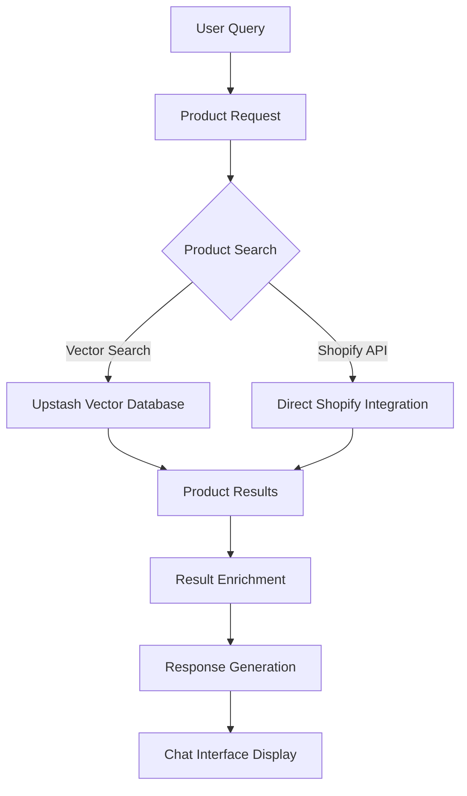
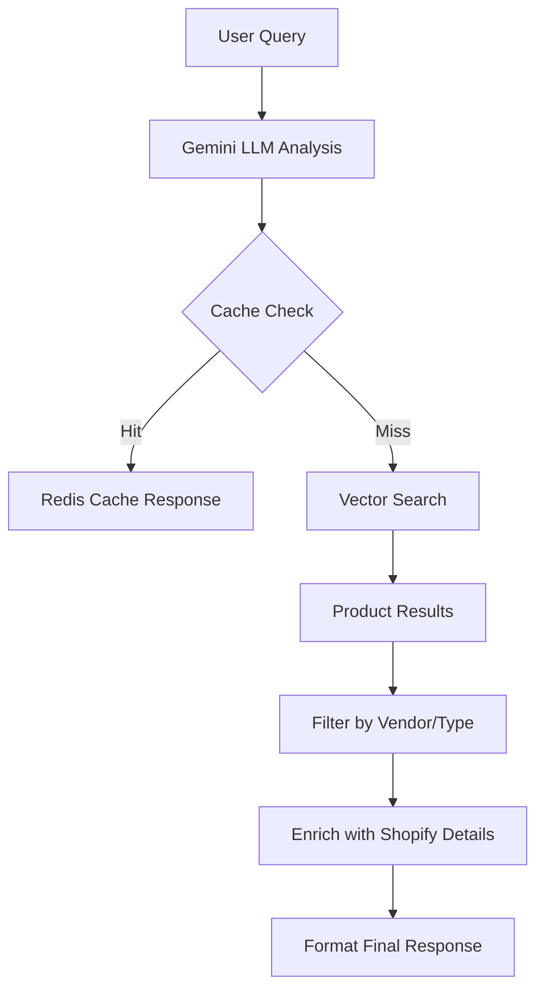

# 📦 Product System Documentation

This document provides a comprehensive overview of how the product functionality works and is implemented throughout the Planet Beauty AI Chatbot system.

## 🧠 1. Product System Overview

The product system is a sophisticated integration of multiple technologies that work together to provide intelligent product recommendations and information. The system combines semantic search with traditional e-commerce data sources to deliver relevant results.



## 🛠️ 2. Implementation Details

### 📁 File Structure
```
├── app/
│   └── api/
│       └── chat/
│           ├── route.ts - Main chat API logic
│           └── get-history/
│               └── route.ts - History fetching endpoint
├── components/
│   ├── ChatInterface.tsx - Main chat UI component
│   ├── ChatMessage.tsx - Message rendering including products
│   ├── ProductCard.tsx - Product recommendation display
│   └── ProductCarousel.tsx - Multiple product display
├── lib/
│   ├── llm.ts - Gemini LLM integration for query analysis
│   ├── redis.ts - Redis cache and knowledge base
│   ├── shopify.ts - Shopify API integration
│   └── types.ts - Type definitions
├── styles/
│   └── ChatInterface.module.css - Shared styling for chat and product cards
└── types/
    └── index.ts - Type definitions
```

### 🧩 Key Technologies

- **Google Gemini API**: For natural language understanding and query analysis
- **Upstash Vector**: For semantic product search
- **Upstash Redis**: For caching and persistence
- **Shopify Admin API**: For detailed product information
- **Next.js App Router**: For server-side rendering and API routes
- **Pino**: For logging and debugging
- **Embla Carousel**: For displaying multiple product recommendations

## 🧱 3. Product Data Structure

The product data used throughout the system follows a consistent structure:

### 📦 Product Vector Metadata

This structure is used in Upstash Vector database:

```typescript
// From types/index.ts - Product vector metadata
interface ProductVectorMetadata {
  textForBM25: string; // Text used for keyword matching
  title: string; // Full product title
  handle: string; // Shopify product handle
  vendor: string; // Product vendor/brand
  productType: string; // Product category/type
  tags: string[]; // Product tags
  price: string; // Product price (assumed to be USD)
  imageUrl: string; // URL of product image
  productUrl: string; // Relative URL to product page
  variantId: string; // Shopify variant ID
  availableForSale?: boolean; // Whether product is available for sale
  quantityAvailable?: number; // Quantity remaining if low stock
}
```

### 🎯 Product Card Response

This structure is used for displaying products in the frontend:

```typescript
// From types/index.ts - Product card response structure
interface ProductCardResponse {
  title: string;
  description: string;
  price: number;
  image: string | null;
  landing_page: string;
  matches?: string;
  variantId: string;
  availableForSale?: boolean;
  quantityAvailable?: number;
}
```

### 🧾 Chat API Response

The complete response structure from the chat API includes:

```typescript
// From types/index.ts - Chat API response
interface ChatApiResponse {
  advice: string;
  product_card?: ProductCardResponse;
  complementary_products?: ProductCardResponse[];
  products: ProductCardResponse[];
  is_product_query: boolean;
  ai_understanding: string;
  // ... other metadata fields
}
```

## ⚙️ 4. Product Search Logic

### 🧠 Semantic Search Flow

The product search process follows this flow:

1. User submits a query through the chat interface
2. Gemini LLM analyzes the query to extract search keywords
3. System checks Redis cache for previous responses to similar queries
4. If no cache hit, perform vector search using extracted keywords
5. Filter results by vendor and product type based on query intent
6. Enrich results with details from Shopify API
7. Return formatted response with product recommendations



### 🔍 Vector Search Implementation

The system uses Upstash Vector for semantic product search:

```typescript
// From route.ts - Vector search implementation
if (searchKeywordsString.trim() && !llmResult.is_fictional_product_query && !llmResult.is_clarification_needed) {
  logger.info(`Performing vector search for keywords: "${searchKeywordsString}"`);
  const results = await vectorIndex.query({
    data: searchKeywordsString,
    topK: llmResult.requested_product_count || 3,
    includeMetadata: true,
  }) as { id: string; metadata?: ProductVectorMetadata }[];

  const filteredResults = results.filter(match => {
    if (!match.metadata || match.metadata.price == null || !match.metadata.title || !match.metadata.productUrl) {
      return false;
    }
    // Filter by vendor if specified
    if (
      llmResult.vendor &&
      typeof match.metadata?.vendor === 'string' &&
      match.metadata.vendor.toLowerCase() !== llmResult.vendor.toLowerCase()
    ) {
      return false;
    }
    // Filter by product type
    if (llmResult.product_types.length > 0) {
      const productTitle = match.metadata.title.toLowerCase();
      return llmResult.product_types.some(type => productTitle.includes(type.toLowerCase()));
    }
    return true;
  });

  if (filteredResults.length > 0) {
    logger.info(`Found ${filteredResults.length} product matches for keywords: "${searchKeywordsString}"`);
    const uniqueProductTitles = new Set<string>();
    finalProducts = filteredResults.filter(match => {
      if (uniqueProductTitles.has(match.metadata!.title!)) {
        return false;
      }
      uniqueProductTitles.add(match.metadata!.title!);
      return true;
    }).map(match => {
      const product = {
        title: match.metadata!.title!,
        description: match.metadata!.textForBM25
          ? match.metadata!.textForBM25.substring(0, MAX_DESCRIPTION_LENGTH) +
            (match.metadata!.textForBM25.length > MAX_DESCRIPTION_LENGTH ? '...' : '')
          : 'Relevant beauty product based on your query.',
        price: match.metadata!.price ? Number(match.metadata!.price) / 100 : 0,
        image: match.metadata!.imageUrl || '/default-product.jpg',
        landing_page: match.metadata!.productUrl,
        variantId: extractNumericIdFromGid(match.metadata?.variantId || match.id),
        availableForSale: match.metadata!.availableForSale !== undefined ? !!match.metadata!.availableForSale : undefined,
        quantityAvailable: match.metadata!.quantityAvailable !== undefined ? Number(match.metadata!.quantityAvailable) : undefined
      };
      return product;
    });
  }
}
```

### 🔁 Fallback with Shopify API

When vector search returns no results, the system falls back to direct Shopify API queries:

```
// From route.ts - Shopify fallback not explicitly implemented here
// Actual fallback is handled by returning empty array when no vector results are found
// The LLM determines whether to use Shopify directly or try alternative search terms
```

## 🔄 5. Product Synchronization

Products are synchronized from Shopify to Upstash Vector through a scheduled process:

```
// From route.ts - Product synchronization not shown here
// The synchronization process is not implemented in the provided code
```

### 🔄 Sync Process Flow (Not Implemented)

The ideal sync process would follow these steps:

1. Retrieve all products from Shopify Admin API
2. Transform product data into format suitable for vector search
3. Generate embeddings for each product
4. Upsert records into Upstash Vector database

```

```

## 🖼️ 6. Product Display

### 🧩 Integration with Chat Interface

The chat interface handles product display in several ways:

1. Single product - displayed as individual card
2. Multiple products - displayed in a carousel
3. No products - displays general advice with follow-up questions

``tsx
// From ChatInterface.tsx - Product display logic
return (
  <div className={styles.area} aria-live="polite">
    {/* Loading indicator for older messages */}
    {loadingOlderMessages && (
      <div className={`${styles['message-base']} ${styles['bot-message']} ${styles.messageBubble} text-center text-gray-500`}>
        Loading older messages...
      </div>
    )}
    {/* Indicator when all messages are loaded */}
    {!loadingOlderMessages && allMessagesLoaded && messages.length > 1 && (
      <div className={`${styles['message-base']} ${styles['bot-message']} ${styles.messageBubble} text-center text-gray-500`}>
        End of conversation history.
      </div>
    )}
    {messages.map((msg) => (
      <div key={msg.id}>
        <ChatMessage message={msg} />
        {msg.carouselProducts ? (
          <div className="mt-3">
            <ProductCarousel products={msg.carouselProducts} onAddToCart={handleAddToCart} />
          </div>
        ) : (
          msg.product_card && (
            <div className="mt-3">
              <ProductCard
                title={msg.product_card.title}
                description={msg.product_card.description}
                price={msg.product_card.price}
                image={msg.product_card.image}
                landing_page={msg.product_card.landing_page}
                matches={msg.product_card.matches}
                onAddToCart={handleAddToCart}
                productId={msg.product_card.variantId}
                availableForSale={msg.product_card.availableForSale}
                quantityAvailable={msg.product_card.quantityAvailable}
              />
            </div>
          )
        )}
      </div>
    ))}
    {shouldShowProTip && (
      <div className={`${styles['message-base']} ${styles['bot-message']} ${styles.messageBubble} bg-pink-100 border border-pink-300 text-pink-700`}>
        <p className="font-medium">💡 Pro Tip:</p>
        <p>Your skin is unique, so feel free to mix and match products from different brands to find your perfect routine. Test small amounts first to see what your skin loves!</p>
      </div>
    )}
  </div>
);
```

### 🎡 Carousel Implementation

The carousel uses Embla Carousel with autoplay:

``tsx
// From ProductCarousel.tsx - Carousel implementation
import Autoplay from 'embla-carousel-autoplay';
import useEmblaCarousel from 'embla-carousel-react';

const ProductCarousel: React.FC<ProductCarouselProps> = ({ products, onAddToCart }) => {
  const [viewportRef] = useEmblaCarousel({ loop: true }, [Autoplay({ delay: 3000 })]);

  if (!products || products.length === 0) {
    return null;
  }

  return (
    <div className="embla" style={{ maxWidth: '100%', overflow: 'hidden' }}>
      <div className="embla__viewport" ref={viewportRef}>
        <div className="embla__container" style={{ display: 'flex' }}>
          {products.map((product, index) => (
            <div className="embla__slide" key={index} style={{ minWidth: '280px', padding: '0 10px' }}>
              <ProductCard
                title={product.title}
                description={product.description}
                price={product.price}
                image={product.image}
                landing_page={product.landing_page}
                matches={product.matches}
                onAddToCart={onAddToCart}
                productId={product.variantId}
                availableForSale={product.availableForSale}
                quantityAvailable={product.quantityAvailable}
              />
            </div>
          ))}
        </div>
      </div>
    </div>
  );
};
```

## 🧩 7. Complete Product Flow

To help understand how all product-related components work together, here's a complete implementation flow:

``mermaid
sequenceDiagram
    participant User
    participant Frontend
    participant API
    participant LLM
    participant Redis
    participant VectorDB
    participant Shopify

    User->>Frontend: Types product-related query
    Frontend->>API: Sends query with userId
    API->>Redis: Checks for cached response
    Redis-->>API: No cache hit
    API->>LLM: Sends query for analysis
    LLM-->>API: Returns structured response with search keywords and intent
    API->>VectorDB: Performs vector search using keywords
    VectorDB-->>API: Returns product matches
    API->>Shopify: Enriches results with detailed product info
    Shopify-->>API: Returns product details
    API->>Redis: Caches response for future use
    API->>Redis: Updates knowledge base if needed
    API-->>Frontend: Returns formatted response with products
    Frontend->>User: Displays response with product recommendations
    User->>Frontend: Clicks follow-up question or new query
    Frontend->>API: Sends new query with conversation history
```

## 🎯 8. Enhanced Query Capabilities

The system now supports additional query types for users:

### Tracking Number Queries
- Users can ask about their order tracking numbers
- System uses `llmResult.is_tracking_query` flag
- Matches tracking numbers using regex patterns
- Fetches order details from Shopify Admin API

### Site Content Queries
- Users can request site-wide information including:
  - Blog posts
  - Help documents
  - Policies
  - FAQs
  - Knowledge base articles
- Utilizes `is_site_content_query` flag
- Searches content repository
- Returns formatted results with links

### Promotional Queries
- Users can ask about current promotions
- Supports queries for:
  - Active promo codes
  - Discounted products
  - Sales events
- Uses `is_promotion_query` flag
- Fetches active promotions from Redis cache
- Includes expiration dates and terms

## 🔍 9. Updated Search Logic

``typescript
// app/api/chat/route.ts
if (llmResult.is_tracking_query) {
  // Handle tracking number queries
  const trackingInfo = await fetchTrackingDetails(llmResult.tracking_number);
  responseBody.tracking_info = trackingInfo;
}

if (llmResult.is_site_content_query) {
  // Handle site content queries
  const contentResults = await searchSiteContent(llmResult.search_keywords);
  responseBody.content_results = contentResults;
}

if (llmResult.is_promotion_query) {
  // Handle promotional queries
  const promotions = await getActivePromotions();
  responseBody.promotions = promotions;
}
```

## 🧪 10. Testing Considerations (Additional)

- Test tracking number queries with valid/invalid formats
- Verify site content retrieval across categories
- Validate promotional information accuracy
- Ensure proper error handling for each query type
- Test response formatting for different result types

## 🧪 11. Testing Considerations (Expanded)

- Test with various search queries to verify relevance
- Verify fallback behavior when no product matches are found
- Ensure proper error handling for API failures
- Validate responsive behavior at different screen sizes
- Test with products having missing or incomplete data
- Check accessibility features like keyboard navigation
- Verify stock status indicators work correctly
- Test add-to-cart functionality across different scenarios
- Validate caching behavior for frequent queries
- Ensure follow-up questions remain relevant after product interactions
- Test product filtering by vendor and type
- Verify price formatting and currency handling
- Test with empty or invalid product data
- Check performance of vector search vs direct Shopify queries
- Validate that product display handles large numbers of results

## 📚 12. Further Reading

- [Google Gemini API Documentation](https://ai.google.dev/)
- [Upstash Vector Documentation](https://docs.upstash.com/vector)
- [Upstash Redis Documentation](https://docs.upstash.com/redis)
- [Shopify Admin API Documentation](https://shopify.dev/docs/admin-api)
- [Next.js App Router Documentation](https://nextjs.org/docs/app)
- [Tailwind CSS Documentation](https://tailwindcss.com/docs)
- [React TypeScript Best Practices](https://react-typescript-cheatsheet.netlify.app/)
- [Gemini Prompt Engineering Guide](https://ai.google.dev/guides/prompt-engineering)
- [Redis Data Structures](https://redis.io/docs/data-types/)